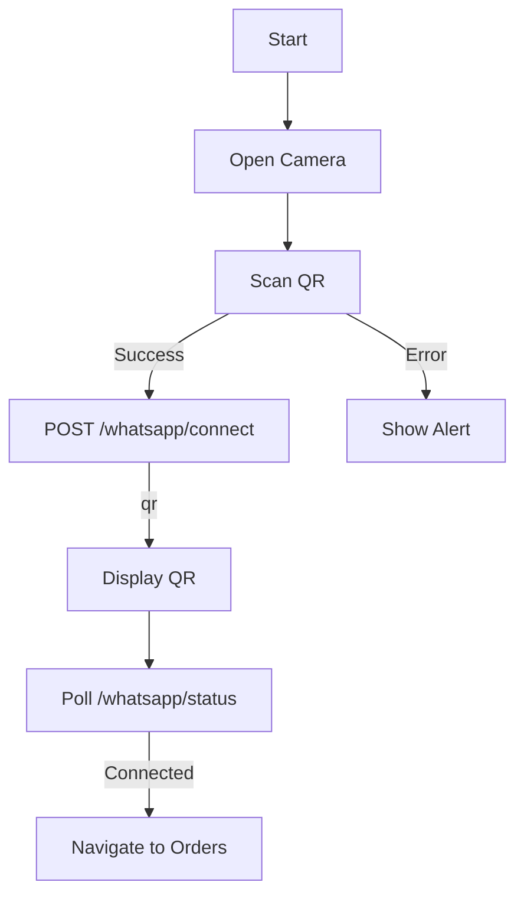

# WhatsApp Order Auto-Wrangler — Frontend Design System

## 1. Theme & UI Components

### Color Palette
```
--primary-50: #eef2ff;
--primary-100: #e0e7ff;
--primary-500: #6366f1;
--primary-600: #4f46e5;
--primary-700: #4338ca;
--secondary-50: #f0f9ff;
--secondary-100: #e0f2fe;
--secondary-500: #0ea5e9;
--secondary-600: #0284c7;
--success-50: #f0fdf4;
--success-500: #22c55e;
--warning-50: #fefce8;
--warning-500: #eab308;
--error-50: #fef2f2;
--error-500: #ef4444;
--gray-50: #f9fafb;
--gray-100: #f3f4f6;
--gray-500: #6b7280;
--gray-800: #1f2937;
--dark-500: #111827;
--light-100: #ffffff;
```

### Typography
```
--font-heading: 'Inter', sans-serif;
--font-body: 'Inter', sans-serif;

--text-xs: 0.75rem; /* 12px */
--text-sm: 0.875rem; /* 14px */
--text-base: 1rem; /* 16px */
--text-lg: 1.125rem; /* 18px */
--text-xl: 1.25rem; /* 20px */
--text-2xl: 1.5rem; /* 24px */

--weight-light: 300;
--weight-normal: 400;
--weight-medium: 500;
--weight-semibold: 600;
--weight-bold: 700;
```

### Spacing & Layout
```
--spacing-xs: 0.5rem; /* 8px */
--spacing-sm: 0.75rem; /* 12px */
--spacing-md: 1rem; /* 16px */
--spacing-lg: 1.5rem; /* 24px */
--spacing-xl: 2rem; /* 32px */

--radius-sm: 0.25rem; /* 4px */
--radius-md: 0.375rem; /* 6px */
--radius-lg: 0.5rem; /* 8px */
--radius-full: 9999px;

--shadow-sm: 0 1px 2px rgba(0, 0, 0, 0.05);
--shadow-md: 0 4px 6px rgba(0, 0, 0, 0.1);
--shadow-lg: 0 10px 15px rgba(0, 0, 0, 0.1);
```

### Component Inventory
| Component            | Purpose                                                                 | Props                                                                                     |
|---------------------|-------------------------------------------------------------------------|------------------------------------------------------------------------------------------|
| `Button`            | Primary interaction (CTA, confirm, etc.)                               | `variant` (primary/secondary), `size` (sm/md/lg), `disabled`, `onClick`                 |
| `Card`              | Order container                                                         | `title`, `status`, `children`                                                            |
| `OrderCard`         | Mobile-friendly order summary                                           | `order`, `onConfirm`, `onFulfill`                                                        |
| `OrderTable`        | Web dashboard data grid                                                  | `orders`, `onExport`, `onFilter`                                                         |
| `QRScanner`         | Capacitor barcode scanner                                                | `onScan`, `torchOn`                                                                       |
| `PaymentButton`     | Paystack/M-Pesa link generator (optional)                               | `orderId`, `amount`                                                                      |
| `Alert`             | Toast notifications                                                     | `type` (success/warning/error/info), `message`                                           |
| `Spinner`           | Loading indicator                                                       | `size` (sm/md/lg)                                                                         |

---

## 2. Screen Specifications

### Mobile App (Capacitor + React)

#### **1. ScanQR Screen**
- **Layout**: Full-screen camera preview with semi-transparent overlay
- **Components**: `QRScanner`, `Button` (torch toggle), `Alert` (error state)
- **API Calls**:  
  - `POST /whatsapp/connect` (initiate Baileys session)
  - `GET /whatsapp/status` (poll connection status)
- **State**: `qrCode` (base64), `scanning` (boolean), `error` (string)



#### **2. Orders Screen**
- **Layout**: Scrollable list of `OrderCard` components
- **Components**: `OrderCard`, `Spinner` (loading), `Alert` (empty state)
- **API Calls**:
  - `GET /orders/` (list orders, filtered by `status=pending`)
  - `POST /orders/{id}/confirm` (send confirmation message)
  - `PATCH /orders/{id}` (update status to `fulfilled`)
- **State**: `orders` (array), `loading` (boolean), `error` (string)

```mermaid
flowchart TD
    A[Mount] --> B[GET /orders?status=pending]
    B -->|Success| C[Render OrderCards]
    B -->|Error| D[Show Alert]
    C --> E[User taps 'Confirm']
    E --> F[POST /orders/{id}/confirm]
    F --> G[Update UI]
```

#### **3. Settings Screen**
- **Layout**: Form with user profile and app preferences
- **Components**: `Input` (name/phone), `Button` (save), `Alert` (status)
- **API Calls**:
  - `GET /users/{id}` (fetch profile)
  - `PATCH /users/{id}` (update profile)
- **State**: `user` (object), `saving` (boolean)

---

### Web Merchant Dashboard

#### **1. Orders Screen**
- **Layout**: Sidebar navigation + `OrderTable` with filters
- **Components**: `OrderTable`, `Sidebar`, `Button` (export/filter)
- **API Calls**:
  - `GET /orders/` (list all orders, optional filters)
  - `GET /dashboard/stats` (summarize order counts)
- **State**: `orders` (array), `filters` (object)

#### **2. Export Screen**
- **Layout**: Simple button-driven interface
- **Components**: `Button` (export CSV), `Alert` (status)
- **API Calls**:
  - `GET /orders/export` (download CSV)

---

## 3. API Integration

### Mobile App API Client (`utils/api.ts`)
```typescript
const API_URL = process.env.VITE_API_URL;

export const api = {
  whatsapp: {
    connect: () => POST(`${API_URL}/whatsapp/connect`),
    status: () => GET(`${API_URL}/whatsapp/status`),
  },
  orders: {
    list: (status: string) => GET(`${API_URL}/orders/?status=${status}`),
    confirm: (id: string, message: string) => POST(`${API_URL}/orders/${id}/confirm`, { message }),
  },
};
```

### Web Dashboard API Client
```typescript
const API_URL = import.meta.env.VITE_API_URL;

export const dashboardApi = {
  orders: {
    list: (filters: { status?: string; dateFrom?: string }) => GET(`${API_URL}/orders/`, filters),
    stats: () => GET(`${API_URL}/dashboard/stats`),
    export: () => GET(`${API_URL}/orders/export`, {}, { responseType: 'blob' }),
  },
};
```

---

## 4. Error Handling & Loading States

### Mobile Patterns
- **Loading**: Full-screen `Spinner` (initial load) or inline `Spinner` (pagination)
- **Errors**: `Alert` components with retry buttons
- **Empty States**: Illustrations + descriptive text (e.g., "No pending orders")

### Web Patterns
- **Data Table**: Skeleton rows during loading
- **Export**: Disabled button + `Spinner` during export
- **Form Errors**: Inline validation messages

---

APPROVED FOR BUILD